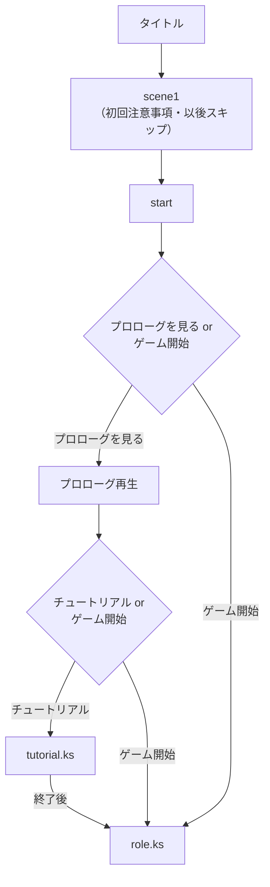
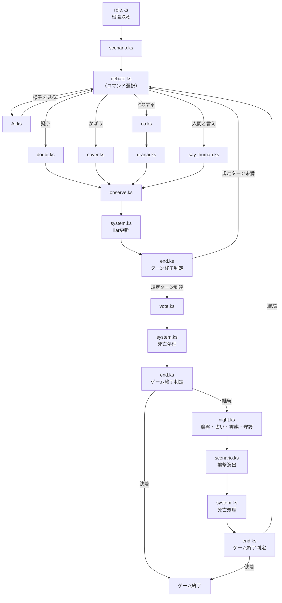

# ジャンケット人狼ゲーム ― 設計解説（ポートフォリオ）


> 嘘つきを見破れ、1人用AI対戦人狼ゲーム。

漫画『ジャンケットバンク』の非公式二次創作・ファンメイドゲーム「ジャンケット人狼ゲーム」の、設計・技術解説をまとめたドキュメントです。

**実際に遊べるデモはこちら → [▶ Play Demo](https://bug-slayers-n.github.io/JB_JINRO/)**
**ゲーム本体のリポジトリ → [JB_JINRO](https://github.com/bug-slayers-N/JB_JINRO)**
**プレイ動画 → [デモ動画を見る（X/Twitter）](https://x.com/fanmadegame_JB/status/2058382599433887843)**

### 🔍 このプロジェクトで示せること

- **要件定義力**：人狼ゲームという「人間の曖昧な読み合い」を、HP・好感度・視点付き認識という具体的な数値構造に翻訳した設計力
- **複数リソースを動かす体制構築力**：イラスト・実装・テストという異なる役割を担う3者を動かし、1つの成果物として完成させたディレクション経験
- **スケジュール管理・完走力**：本業（週5勤務）と並行し、2ヶ月弱で要件定義・実装・テスト・調整まで完走
- **技術理解を伴うディレクション**：設計から実装の構造まで自分で把握した上で指示を出せる、技術知見のあるディレクション

---

## 目次

- [🤝 体制・進行管理](#-体制進行管理)
- [🎮 ゲーム概要](#-ゲーム概要)
- [🧠 設計思想①：人狼を「HP」で再現する](#-設計思想人狼をhpで再現する)
- [🏗️ 設計思想②：拡張性を見据えた構造](#️-設計思想拡張性を見据えた構造)
- [🛠️ 技術スタック・ファイル構成](#️-技術スタックファイル構成)
- [📋 ゲームフロー図](#-ゲームフロー図)
- [🚀 遊んでみる](#-遊んでみる)
- [📝 今後の実装予定](#-今後の実装予定)
- [ライセンス・クレジット](#ライセンスクレジット)

---

## 🤝 体制・進行管理

| 役割 | 担当 |
|---|---|
| 企画・要件定義・進行管理 | らき（自身もイラストが描くことができ、イラスト工程への理解を持った上で進行） |
| イラスト・UI | [サカゴメさん](https://x.com/sakgm831)（詳細な仕様書をもとに制作） |
| 実装・デバッグ | Claude（日本語で書かれた処理をコードへ翻訳、デバッグ） |
| テスト | 別途テスターを起用（クレジットはゲーム本体に記載） |

**スケジュール**：2026年3月28日 開発開始 → 5月24日 公開（約2ヶ月弱）。本業（週5勤務）と並行しながら、公開までにゲームバランス調整・バグ対応を含むテスト期間も確保しています。

**フィードバックループの設計**：イラスト担当には一方的に仕様を渡すだけでなく、現場からの提案を受け付ける運用にしていました。実際にイラスト側からの提案を受けて、特定条件で専用グラフィックが表示される特殊エンディング演出を仕様に追加・実装して好評を得ています。指示を出すだけの一方通行ではなく、現場の発想を仕組みに取り込む形で進行しました。

**テストとリスクマネジメント**：テスターには通常プレイでの分かりにくさ・不便な点のフィードバックを依頼し、見つかったバグ（約20件）はその都度修正しました。再現性の低い不具合が公開後に1件報告されましたが、それ以外は事前のテスト期間内で解消しています。過去6作のゲーム制作の経験から、トラブルが起きやすい箇所はあらかじめ想定して設計段階で対策しており、結果的に「起きてから直す」場面は少なく済みました。

**体感によるバランス調整**：観測フェーズの見破り確率の計算式は、実際にプレイしながら手応えが自然になるまで3回調整しています。数値だけでなく、実際の遊び心地から逆算して調整する工程です。

**設計の反省点**：当初は拡張性をあまり考えずに実装を始めましたが、途中で9人モード以降を見据えて仕様を再設計しました。最初から拡張性を前提に組んでいれば手戻りが少なかったという反省から、現在は設計を先に固めてから実装に入るようにしています。

---

## 🎮 ゲーム概要

人狼ゲームをベースにしたAI対戦型推理ゲームです。ご想像の通り『グノーシア』より着想を受けていますが、基本的な人狼部分以外の仕様は異なります。 
正直な村人陣営と嘘つきの人狼陣営に分かれ、沢山効果的に疑うことにより嘘つきを見破ることが出来ます。 
嘘つきを見つけて処刑するか、村人が嘘つき陣営の人数まで減るまで嘘がばれないように逃げ切るかの頭脳戦レースです。

> 人狼ルールが初めての方へ：村人陣営は人狼を全員処刑すれば勝利、人狼陣営は村人を人狼の数まで減らせば勝利。互いの正体は隠されたまま、議論と投票だけで決着をつけます。詳細なルールはゲーム内プロローグで説明されます。

### 役職一覧（5人モード／9人モード）

| 役職 | 人数（5人/9人） | 主な機能 |
|---|---|---|
| 人狼 | 1人 / 2人 | 仲間の人狼を全員把握できる。偽CO可能。夜間に1人を襲撃 |
| 狂人 | 1人（共通） | 人狼陣営だが人狼の正体は知らない。偽CO可能 |
| 占い師 | 1人（共通） | 夜間に1人を占い、その場で人狼か否かの結果を取得。CO可能 |
| 霊媒師 | 1人（9人のみ） | 毎晩、処刑者の霊媒結果を取得。CO可能 |
| 騎士 | 1人（9人のみ） | 毎晩1人を守護。守護に成功するまでCOできない |
| 村人 | 残り全員 | 追加機能なし |

占いは「人狼か否か」のみを判定し、狂人は人間判定として出ます。

> さらに人数が増える13人モードでは「妖狐」陣営の追加も構想中です。詳細は[今後の実装予定](#-今後の実装予定)へ。

---

## 🧠 設計思想①：人狼を「HP」で再現する

人間同士の人狼ゲームの本質は「相手を疑い、怪しい人に処刑投票する」という曖昧な読み合いです。これをAI対戦として成立させるために、**HPの概念**を導入しました。

- **HPが低いキャラほど、嘘がバレやすくなる**
- 「疑う」＝ HPにダメージを与える攻撃
- 「かばう」＝ HPを回復する支援

この設計により、人狼特有の「会話から怪しい人を探す」という抽象的な行為を、RPGのような直感的な攻撃・回復のインタラクションに変換しました。疑わしい相手のHPを削り、最後に観測フェーズで「嘘つきだ！」と見破るのがこのゲームの基本戦略です。

### HP = calm（平常心） + like（好感度）

HPは1つの変数ではなく、**calm（全体共有の基礎値）** と **like（キャラ視点ごとの好感度）** の合計で構成されています。この二層構造が、人間関係の非対称性を再現する鍵になっています。

| 要素 | 役割 |
|---|---|
| **calm** | キャラごとに初期値が異なる基礎HP。疑うダメージ・かばう回復はすべてここに反映される |
| **like** | キャラ間の好感度（視点付き）。疑うと相手からの好感度が下がり、かばうと上がる |

likeが視点付き（Aから見たB、Bから見たA、をそれぞれ別の値として管理）であることで、「Aは Bを信頼しているが、BはAを信頼していない」という非対称な人間関係が成立します。

### 観測フェーズ：「観察力」との比較で嘘を見破る

毎ターンの終わりには **観測フェーズ**（`observe.ks`）があり、HPが低い順**下位2人**に対して実際に「嘘を見破れるか」の判定が行われます。
「怪しい奴をジッとよく見る」という人間の振る舞いを、そのままターゲット選定ロジックに落とし込んだ形です。

各キャラには「観察力」というステータスがあり、対象の知覚HPと比較して見破り判定を行います。

1. **観察力 ＜ 対象のHP** の場合 → 自動失敗（演出なし）
2. **観察力 ＞ 対象のHP** の場合 → 以下の確率で見破りが成立

```
成功率(%) = (観察力 − 知覚平常心) ÷ 2 + 観察力 ÷ 5
```

観察力が高いキャラほど、相手のHPがある程度高くても見破れる可能性が出てきます。逆に知覚平常心が高い相手は、観察力で大きく上回らない限り見破られません。

**観測に失敗した場合は、対象への好感度（like）が加算されます。** これは「よく見たけど、やっぱりこの人は違うかも…」という心理を表現したもので、同じキャラばかり疑い続けて観測対象が固定化されることを防ぐ仕組みにもなっています。「疑う」でダメージを与えて削ったHPが、観測フェーズの成功率に直結し、失敗すればまた疑いが晴れていく——という一連の駆け引きが、このゲームの核心ループです。

### liar：キャラごとに異なる「知っていること」

もう一つの核心は **liar** 変数です。これは各キャラ視点での「誰が嘘をついていたか」という認識を、視点ごとに個別管理しています。

例：村人Aが占い師Bから「Aは人狼」と報告を受けた場合、Aの視点では「Bは嘘つき」という情報がliarに記録されます。これはAIが「疑う」等コマンドの対象選定や、投票先を決める際の判断材料として参照されます。

全キャラが同じ情報を共有する「神視点」ではなく、**キャラごとに見えている情報が異なる**ことで、AI同士が個別に間違えたり、疑心暗鬼になったりする人間らしい推理が生まれます。

---

## 🏗️ 設計思想②：拡張性を見据えた構造

5人モードで止まらず、9人モード・13人モードへの拡張を前提に設計しています。鍵になっているのは「キャラ固有の変数を持たない」という方針です。

### キャラごとの値はすべて配列で一元管理

役職は `f.character`、平常心（HP）は `f.calm` という1本の配列にまとめて管理しています。インデックス＝キャラ番号という対応関係さえ守れば、配列の長さを伸ばすだけで人数を増やせる構造です。キャラが増えるたびに専用の変数を追加する必要がありません。

```javascript
// 役職取得（f.character から）
function getRole(i){ return parseInt(String(f.character).split(',')[i-1]); }

// 平常心取得（f.calm から）
function getCalm(i){ return parseFloat(String(f.calm).split(',')[i-1]); }
```

### 役職番号は「桁」が陣営を兼ねる設計

役職番号にはあらかじめ余白を持たせてあり、さらに**番号の桁そのものが陣営判定ロジックを兼ねる**ように割り振っています。

| 役職 | 番号 | 陣営 |
|---|---|---|
| 人狼 | 1〜5（複数人狼対応） | 人狼陣営 |
| 狂人 | 9 | 人狼陣営 |
| 占い師 | 10 | 村人陣営 |
| 霊媒師 | 11 | 村人陣営 |
| 騎士 | 12 | 村人陣営 |
| 村人 | 15〜（人数分だけ連番） | 村人陣営 |

陣営判定は番号を見るだけの1行で済みます。

```javascript
// 人狼陣営かどうか（役職番号 < 10）
function isWolfTeam(role){ return role < 10; }
```

一桁（10未満）は人狼陣営、二桁は村人陣営という区切りにしてあるため、新しい役職を追加するときも「どちらの陣営に属するか」を意識して番号を振るだけで、陣営判定ロジック自体は一切変更不要です。さらに村人は15番以降を連番で使うだけなので、人数が増えるほど末尾に追加していくだけで対応できます。

### liar / like もスケールする設計

噓の認識（liar）や好感度（like）を格納する配列も、「視点ごとに対象を見た値」を持つため、人数nに対して `n×(n-1)` という人数依存の式でサイズが決まります。9人モードなら72値、13人モードなら156値、というように、人数が変わっても同じロジックで配列サイズを導出できます。

この「配列管理 × 桁で陣営を表す番号設計 × 汎用サイズ式」という3点セットによって、9人モード（霊媒師・騎士の追加）や13人モード（妖狐の追加）は、新しい仕組みをゼロから組み直すのではなく、既存の構造に乗せる形で実装できます。

---

## 🛠️ 技術スタック・ファイル構成

| 分類 | 使用技術 |
|---|---|
| ゲームエンジン | [TyranoBuilder](https://tyranobuilder.com/)（ノベルゲームエンジン） |
| ロジック・AI実装 | JavaScript（iscriptコンポーネント） |
| 状態管理 | TyranoBuilder標準のセーブ機能（外部ファイル・外部DBは使用しない） |
| 公開 | GitHub Pages |

会話パートや画面遷移はTyranoBuilderのノベルゲーム機能に任せ、数値管理・AIの判断ロジックといった「ゲームらしい計算処理」だけをiscriptで自作する、という役割分担で実装しています。状態はすべてTyranoBuilder標準の変数（`f.`変数）に集約しており、外部ファイルを持ち出さずに保存・復元できる構成です。

### ファイル構成

機能ごとに `.ks` ファイルを分割しており、新しい役職や機能を追加する際も既存ファイルを壊さずに済む構造になっています。

| ファイル | 役割 |
|---|---|
| `start.ks` | プロローグ |
| `tutorial.ks` | チュートリアル |
| `scenario.ks` | ストーリー進行 |
| `role.ks` | プレイヤーのキャラ・役職決め |
| `system.ks` | 初期化・死亡処理・噓つき情報の更新など |
| `debate.ks` | 議論フェーズの基本画面・コマンド分岐 |
| `doubt.ks` | 「疑う」処理 |
| `cover.ks` | 「かばう」処理 |
| `observe.ks` | 観測フェーズ（嘘見破り）処理 |
| `co.ks` | CO（カミングアウト）処理 |
| `uranai.ks` | 占い処理 |
| `say_human.ks` | 「人間と言え」処理 |
| `vote.ks` | 投票処理 |
| `night.ks` | 夜フェーズの処理（人狼の襲撃、占い／偽占い、霊媒／偽霊媒、騎士の守護） |
| `end.ks` | ターン終了・ゲーム終了判定 |
| `AI.ks` | 「様子を見る」によるAI行動処理 |
| `UI.ks` | UI・選択肢表示 |
| `キャラ名.ks` | 各キャラクター個別の台詞 |

例えば9人モードで霊媒師・騎士を追加する場合も、この一覧に新しいファイルを追加するだけで対応でき、既存の処理に手を入れる必要はありません。

---

## 📋 ゲームフロー図

### 導入フロー（タイトル〜ゲーム開始）



タイトルから`start.ks`に入ると、プロローグの視聴とゲーム開始を選べます。プロローグを最後まで見ると、その場でチュートリアルへの導線が出現する仕組みです。チュートリアルを終えた場合も、最終的には通常プレイと同じ`role.ks`（役職決め）に合流します。

### ゲームプレイフロー（昼〜投票〜夜）



役職決め後、議論フェーズ（`debate.ks`）で各コマンドに分岐しますが、どのコマンドを選んでも最終的に観測フェーズ（`observe.ks`）に合流し、ターン終了判定を経て次のターンか投票フェーズに進みます。投票・夜フェーズも同様に、死亡処理とゲーム終了判定を挟んでループする構造です。

---

## 🚀 遊んでみる

インストール不要、ブラウザだけで動作します。

**[▶ Play Demo](https://bug-slayers-n.github.io/JB_JINRO/)**

コードの構成については[技術スタック・ファイル構成](#️-技術スタックファイル構成)を参照してください。

---

## 📝 今後の実装予定

| モード | ステータス | 内容 |
|---|---|---|
| 9人モード | 開発中（2026年9月公開予定） | 霊媒師・騎士の追加、抽選・投票対象の9人拡大 |
| 13人モード | 構想段階 | 妖狐陣営の追加（襲撃では死亡せず、処刑または占いで死亡。終了時生存していれば単独勝利） |

5人モードはすでに公開済みですが、[設計思想②](#️-設計思想拡張性を見据えた構造)で触れた配列駆動の構造により、9人モード以降も既存のロジックを壊さず拡張していく予定です。

---

## ライセンス・クレジット

本プロジェクトは漫画『ジャンケットバンク』の**非公式ファンメイド・二次創作**です。原作の著作権は原作者・出版社に帰属します。権利者様からの削除要請があった場合、速やかに非公開とします。

イラスト・背景素材の著作権は、それぞれの制作者に帰属します。無断転用・再配布はできません。

一方、本プロジェクトの**設計・コード部分は自由に利用可能**です。

| 担当 | 内容 |
|---|---|
| 企画・設計・ゲームロジック | らき（個人サークル「第n次バグ討伐隊」） |
| 立ち絵・UIイラスト | [サカゴメ さん](https://x.com/sakgm831) |
| 背景素材 | アキ2号機 さん（フリー素材） |
| 実装・デバッグ | [Claude](https://claude.ai)（日本語で書いた仕様をもとにコードへ翻訳・デバッグを実施。設計・要件定義・指示出しは企画者本人が担当） |

