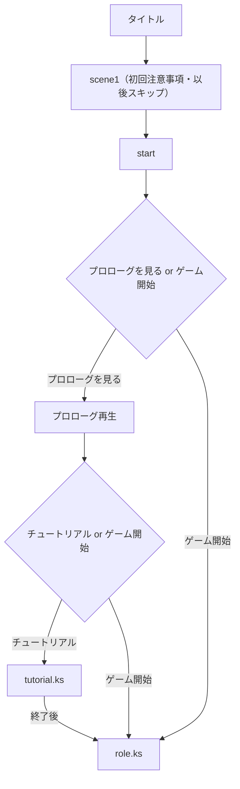
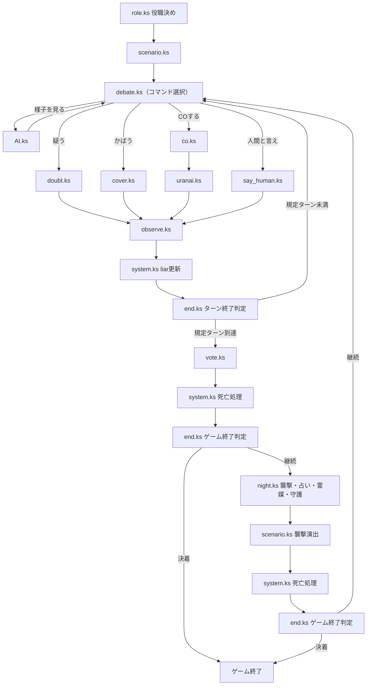

# ジャンケット人狼ゲーム ― 設計解説（ポートフォリオ）


**志望職種：ゲームプランナー / テクニカルプランナー / PM**

**[▶ 今すぐ遊ぶ（デモ）](https://bug-slayers-n.github.io/JB_JINRO/)**
**[▶ プレイ動画を見る（X/Twitter）](https://x.com/fanmadegame_JB/status/2058382599433887843)**
**[一般公開リポジトリ → JB_JINRO](https://github.com/bug-slayers-N/JB_JINRO)**

---

## 📌 要約

- 漫画『ジャンケットバンク』二次創作のAI対戦型人狼ゲーム（非公式・ファンメイド）
- **企画・要件定義・仕様策定・進行管理をすべて1人で担当**。実装はAI（Claude）に仕様書を渡して翻訳させる形で進行
- イラスト担当・テスターを含む**3者体制**で、本業（週5勤務）と並行し**約2ヶ月でリリース**
- 公開1ヶ月で**1,300アクセス・告知ツイート44,000インプレッション・配信2件**
- 5人モード公開済み。9人モード開発中（2026年9月公開予定）

### 🔍 このプロジェクトで示せること

- **要件定義力**：「人間の曖昧な読み合い」をHP・好感度・視点付き認識という数値構造に翻訳した設計力
- **テクニカルプランナーとしての設計力**：確率式・AIロジック・拡張性設計をすべて自分で仕様化し、ロジックの意思決定はすべて自分が担当
- **複数リソースを動かす進行管理力**：イラスト・実装・テストという異なる役割の3者を動かし1つの成果物として完成
- **技術理解を伴うディレクション**：実装の構造まで把握した上で指示を出せる、技術知見のある進行管理

---

## 目次

- [🤝 体制・進行管理](#-体制進行管理)
- [🎮 ゲーム概要](#-ゲーム概要)
- [🧠 設計思想①：人狼を「HP」で再現する](#-設計思想人狼をhpで再現する)
- [🏗️ 設計思想②：拡張性を見据えた構造](#️-設計思想拡張性を見据えた構造)
- [🛠️ 技術スタック・ファイル構成](#️-技術スタックファイル構成)
- [📋 ゲームフロー図](#-ゲームフロー図)
- [🚀 遊んでみる](#-遊んでみる)
- [📝 今後の実装予定](#-今後の実装予定)
- [ライセンス・クレジット](#ライセンスクレジット)

---

## 🤝 体制・進行管理

| 役割 | 担当 |
|---|---|
| 企画・要件定義・進行管理 | らき（自身も同人漫画制作経験があり、イラスト工程への理解を持った上で進行） |
| イラスト・UI | [サカゴメさん](https://x.com/sakgm831)（詳細な仕様書をもとに制作） |
| 実装 | Claude（日本語の詳細仕様書をもとにコードへ翻訳） |
| バグ対応 | らき（発生箇所の目星をつけ、該当コードを読んで自身で修正） |
| テスト | 別途テスターを起用（クレジットはゲーム本体に記載） |

**スケジュール**：2026年3月28日 開発開始 → 5月24日 公開（約2ヶ月弱）。本業（週5勤務）と並行しながら、公開までにゲームバランス調整・バグ対応を含むテスト期間も確保しています。

**フィードバックループの設計**：イラスト担当には一方的に仕様を渡すだけでなく、現場からの提案を受け付ける運用にしていました。実際にイラスト側からの提案を受けて、特定条件で専用グラフィックが表示される特殊エンディング演出を仕様に追加・実装しています。

**テストとリスクマネジメント**：テスターには通常プレイでの分かりにくさ・不便な点のフィードバックを依頼し、見つかったバグ（約20件）はその都度修正しました。再現性の低い不具合が公開後に1件報告されましたが、それ以外は事前のテスト期間内で解消しています。ゲーム制作の経験から、トラブルが起きやすい箇所はあらかじめ想定して設計段階で対策しており、「起きてから直す」場面は少なく済みました。

**体感によるバランス調整**：観測フェーズの見破り確率の計算式は、実際にプレイしながら手応えが自然になるまで3回調整しています。

**設計の反省点**：当初は拡張性をあまり考えずに実装を始めましたが、途中で9人モード以降を見据えて仕様を再設計しました。最初から拡張性を前提に組んでいれば手戻りが少なかったという反省から、現在は設計を先に固めてから実装に入るようにしています。

---

## 🎮 ゲーム概要

AI対戦型の人狼推理ゲームです。プレイヤー1人＋AI最大8人で、怪しい相手を疑い・かばい・嘘を見破ることを目指します。現在5人モード（人狼1・狂人1・占い師1・村人2）が公開済み。9人モード（霊媒師・騎士追加）を開発中、13人モード（妖狐追加）を構想中です。詳細なルールはゲーム内チュートリアルで説明されます。

---

## 🧠 設計思想①：人狼を「HP」で再現する

### なぜ「HP」という設計に辿り着いたか

人狼ゲームのAI化において、既存タイトル（グノーシア等）のアプローチをそのまま採用すると独自性がなくなります。そこで、「怪しい相手を疑い、嘘を見破る」という抽象的な読み合いを、**HP・ダメージ・回復という直感的な構造**に翻訳することで、独自のゲームシステムとして成立させました。

- **HPが低いキャラほど、嘘がバレやすくなる**
- 「疑う」＝ HPにダメージを与える攻撃
- 「かばう」＝ HPを回復する支援

### HP = calm（平常心） + like（好感度）

HPは1つの変数ではなく、**calm（全体共有の基礎値）** と **like（キャラ視点ごとの好感度）** の合計で構成されています。

| 要素 | 役割 |
|---|---|
| **calm** | キャラごとに初期値が異なる基礎HP。疑うダメージ・かばう回復はすべてここに反映される |
| **like** | キャラ間の好感度（視点付き）。疑うと相手からの好感度が下がり、かばうと上がる |

likeが視点付き（Aから見たB、Bから見たA、をそれぞれ別の値として管理）であることで、「Aは Bを信頼しているが、BはAを信頼していない」という非対称な人間関係が成立します。

### 知覚平常心：主観のHP

calmとlikeを足し合わせたものが **知覚平常心** です。「客観的なHP」に「自分から見たその人への信頼補正」を加えた主観のHPです。この知覚平常心が低い順に下位2人が、次の観測フェーズの対象として自動的に選ばれます。

```
知覚平常心 = calm（基礎HP） + like（自分から見た好感度）
```

### 観測フェーズ：仕様書から実装への変換例

このゲームの中核ロジックである観測処理は、以下のような日本語仕様書をClaudeに渡してコードに変換させています。**ロジックの設計・意思決定はすべて自分が行い、Claudeはその翻訳のみを担当しています。**

```
f.aliveを確認し生存している全キャラクターに対して、それぞれ自分以外の
f.calm + f.likeの合計値である知覚平常心を取得する
知覚平常心を並び替え、下位2位にあたるキャラに対して以下の処理を行う

視点キャラの観察力（ハードコード）- 知覚平常心 = 差分

差分が ≦ 0 の場合：観測失敗として処理を終了する
差分が > 0 の場合：f.characterを参照し、対象が人狼陣営（< 10）か確認する

人狼陣営でない場合：観測失敗として処理を終了する
人狼陣営の場合：（視点キャラ観察力 ÷ 5 + 差分 ÷ 2）÷ 100 の確率で抽選を行う

外れた場合：観測失敗。対象への好感度（like）を加算する
当選した場合：視点キャラのf.liarの該当キャラ枠に1を代入する
             f.player視点が当選した場合、targetにliar、ai_resultに当選キャラ番号を格納する
```

見破りに失敗した場合にlikeを加算する設計は、「よく見たけどやっぱり違うかも…」という心理を表現したもので、同じキャラばかり観測対象が固定化されることを防ぐ仕組みにもなっています。

### liar：キャラごとに異なる「知っていること」

**liar** 変数は各キャラ視点での「誰が嘘をついていたか」という認識を視点ごとに個別管理しています。全キャラが同じ情報を共有する「神視点」ではなく、**キャラごとに見えている情報が異なる**ことで、AI同士が個別に間違えたり疑心暗鬼になったりする人間らしい推理が生まれます。

---

## 🏗️ 設計思想②：拡張性を見据えた構造

5人→9人→13人モードへの拡張を前提に設計しています。鍵は「キャラ固有の変数を持たない」という方針です。

### キャラごとの値はすべて配列で一元管理

役職は `f.character`、平常心は `f.calm` という1本の配列で管理しています。配列の長さを伸ばすだけで人数を増やせる構造です。

```javascript
function getRole(i){ return parseInt(String(f.character).split(',')[i-1]); }
function getCalm(i){ return parseFloat(String(f.calm).split(',')[i-1]); }
```

### 役職番号は「桁」が陣営を兼ねる設計

| 役職 | 番号 | 陣営 |
|---|---|---|
| 人狼 | 1〜5（複数人狼対応） | 人狼陣営 |
| 狂人 | 9 | 人狼陣営 |
| 占い師 | 10 | 村人陣営 |
| 霊媒師 | 11 | 村人陣営 |
| 騎士 | 12 | 村人陣営 |
| 村人 | 15〜（人数分だけ連番） | 村人陣営 |

```javascript
// 人狼陣営かどうか（役職番号 < 10）
function isWolfTeam(role){ return role < 10; }
```

一桁（10未満）が人狼陣営、二桁が村人陣営という区切りにしてあるため、新しい役職を追加しても陣営判定ロジック自体は変更不要です。liar・like配列のサイズも `n×(n-1)` という汎用式で導出できます（9人=72値、13人=156値）。

---

## 🛠️ 技術スタック・ファイル構成

| 分類 | 使用技術 |
|---|---|
| ゲームエンジン | [TyranoBuilder](https://tyranobuilder.com/)（ノベルゲームエンジン） |
| ロジック・AI実装 | JavaScript（iscriptコンポーネント） |
| 状態管理 | TyranoBuilder標準のセーブ機能（外部ファイル・外部DB不使用） |
| 公開 | GitHub Pages |

会話パートや画面遷移はTyranoBuilderに任せ、数値管理・AIロジックだけをiscriptで自作する役割分担です。状態はすべて `f.` 変数に集約しており、外部ファイルなしで保存・復元できます。

### ファイル構成

| ファイル | 役割 |
|---|---|
| `start.ks` | プロローグ |
| `tutorial.ks` | チュートリアル |
| `scenario.ks` | ストーリー進行 |
| `role.ks` | プレイヤーのキャラ・役職決め |
| `system.ks` | 初期化・死亡処理・噓つき情報の更新など |
| `debate.ks` | 議論フェーズの基本画面・コマンド分岐 |
| `doubt.ks` | 「疑う」処理 |
| `cover.ks` | 「かばう」処理 |
| `observe.ks` | 観測フェーズ（嘘見破り）処理 |
| `co.ks` | CO（カミングアウト）処理 |
| `uranai.ks` | 占い処理 |
| `say_human.ks` | 「人間と言え」処理 |
| `vote.ks` | 投票処理 |
| `night.ks` | 夜フェーズ（襲撃・占い／偽占い・霊媒／偽霊媒・守護） |
| `end.ks` | ターン終了・ゲーム終了判定 |
| `AI.ks` | 「様子を見る」によるAI行動処理 |
| `UI.ks` | UI・選択肢表示 |
| `キャラ名.ks` | 各キャラクター個別の台詞 |

---

## 📋 ゲームフロー図

### 導入フロー（タイトル〜ゲーム開始）


```mermaid
flowchart TD
    A[タイトル] --> B["scene1（初回注意事項・以後スキップ）"]
    B --> C[start]
    C --> D{プロローグを見る or ゲーム開始}
    D -->|プロローグを見る| E[プロローグ再生]
    E --> F{チュートリアル or ゲーム開始}
    F -->|チュートリアル| G[tutorial.ks]
    F -->|ゲーム開始| H[role.ks]
    D -->|ゲーム開始| H
    G -->|終了後| H
```

### ゲームプレイフロー（昼〜投票〜夜）


```mermaid
flowchart TD
    R[role.ks 役職決め] --> S[scenario.ks]
    S --> DB["debate.ks（コマンド選択）"]
    DB -->|疑う| Doubt[doubt.ks]
    DB -->|かばう| Cover[cover.ks]
    DB -->|様子を見る| AI[AI.ks] --> DB
    DB -->|COする| CO[co.ks] --> Uranai[uranai.ks]
    DB -->|人間と言え| Human[say_human.ks]

    Doubt --> OB[observe.ks]
    Cover --> OB
    Uranai --> OB
    Human --> OB

    OB --> SYS[system.ks liar更新]
    SYS --> END1[end.ks ターン終了判定]
    END1 -->|規定ターン未満| DB
    END1 -->|規定ターン到達| VOTE[vote.ks]

    VOTE --> SYS2[system.ks 死亡処理]
    SYS2 --> END2[end.ks ゲーム終了判定]
    END2 -->|決着| GameEnd[ゲーム終了]
    END2 -->|継続| NIGHT[night.ks 襲撃・占い・霊媒・守護]
    NIGHT --> SC2[scenario.ks 襲撃演出]
    SC2 --> SYS3[system.ks 死亡処理]
    SYS3 --> END3[end.ks ゲーム終了判定]
    END3 -->|決着| GameEnd
    END3 -->|継続| DB
```

---

## 🚀 遊んでみる

インストール不要、ブラウザだけで動作します。

**[▶ 今すぐ遊ぶ（デモ）](https://bug-slayers-n.github.io/JB_JINRO/)**
**[▶ プレイ動画を見る（X/Twitter）](https://x.com/fanmadegame_JB/status/2058382599433887843)**

---

## 📝 今後の実装予定

| モード | ステータス | 内容 |
|---|---|---|
| 9人モード | 開発中（2026年9月公開予定） | 霊媒師・騎士の追加、抽選・投票対象の9人拡大 |
| 13人モード | 構想段階 | 妖狐陣営の追加（襲撃では死亡せず、処刑または占いで死亡。終了時生存で単独勝利） |

---

## ライセンス・クレジット

本プロジェクトは漫画『ジャンケットバンク』の**非公式ファンメイド・二次創作**です。原作の著作権は原作者・出版社に帰属します。権利者様からの削除要請があった場合、速やかに非公開とします。

イラスト・背景素材の著作権は、それぞれの制作者に帰属します。無断転用・再配布はできません。

一方、本プロジェクトの**設計・コード部分は自由に利用可能**です。

| 担当 | 内容 |
|---|---|
| 企画・設計・ゲームロジック | らき（個人サークル「第n次バグ討伐隊」） |
| 立ち絵・UIイラスト | [サカゴメ さん](https://x.com/sakgm831) |
| 背景素材 | アキ2号機 さん（フリー素材） |
| 実装 | [Claude](https://claude.ai)（日本語の詳細仕様書をもとにコードへ翻訳） |
- 公開1ヶ月で**1,300アクセス・告知ツイート44,000インプレッション・配信2件**
- 5人モード公開済み。9人モード開発中（2026年9月公開予定）

### 🔍 このプロジェクトで示せること

- **要件定義力**：「人間の曖昧な読み合い」をHP・好感度・視点付き認識という数値構造に翻訳した設計力
- **テクニカルプランナーとしての設計力**：確率式・AIロジック・拡張性設計をすべて自分で仕様化し、ロジックの意思決定はすべて自分が担当
- **複数リソースを動かす進行管理力**：イラスト・実装・テストという異なる役割の3者を動かし1つの成果物として完成
- **技術理解を伴うディレクション**：実装の構造まで把握した上で指示を出せる、技術知見のある進行管理

---

## 目次

- [🤝 体制・進行管理](#-体制進行管理)
- [🎮 ゲーム概要](#-ゲーム概要)
- [🧠 設計思想①：人狼を「HP」で再現する](#-設計思想人狼をhpで再現する)
- [🏗️ 設計思想②：拡張性を見据えた構造](#️-設計思想拡張性を見据えた構造)
- [🛠️ 技術スタック・ファイル構成](#️-技術スタックファイル構成)
- [📋 ゲームフロー図](#-ゲームフロー図)
- [🚀 遊んでみる](#-遊んでみる)
- [📝 今後の実装予定](#-今後の実装予定)
- [ライセンス・クレジット](#ライセンスクレジット)

---

## 🤝 体制・進行管理

| 役割 | 担当 |
|---|---|
| 企画・要件定義・進行管理 | らき（自身も同人漫画制作経験があり、イラスト工程への理解を持った上で進行） |
| イラスト・UI | [サカゴメさん](https://x.com/sakgm831)（詳細な仕様書をもとに制作） |
| テスト | 別途テスターを起用（クレジットはゲーム本体に記載） |

**スケジュール**：2026年3月28日 開発開始 → 5月24日 公開（約2ヶ月弱）。本業（週5勤務）と並行しながら、公開までにゲームバランス調整・バグ対応を含むテスト期間も確保しています。

**フィードバックループの設計**：イラスト担当には一方的に仕様を渡すだけでなく、現場からの提案を受け付ける運用にしていました。実際にイラスト側からの提案を受けて、特定条件で専用グラフィックが表示される特殊エンディング演出を仕様に追加・実装しています。

**テストとリスクマネジメント**：テスターには通常プレイでの分かりにくさ・不便な点のフィードバックを依頼し、見つかったバグ（約20件）はその都度修正しました。再現性の低い不具合が公開後に1件報告されましたが、それ以外は事前のテスト期間内で解消しています。ゲーム制作の経験から、トラブルが起きやすい箇所はあらかじめ想定して設計段階で対策しており、「起きてから直す」場面は少なく済みました。

**体感によるバランス調整**：観測フェーズの見破り確率の計算式は、実際にプレイしながら手応えが自然になるまで3回調整しています。

**設計の反省点**：当初は拡張性をあまり考えずに実装を始めましたが、途中で9人モード以降を見据えて仕様を再設計しました。最初から拡張性を前提に組んでいれば手戻りが少なかったという反省から、現在は設計を先に固めてから実装に入るようにしています。

---

## 🎮 ゲーム概要

AI対戦型の人狼推理ゲームです。プレイヤー1人＋AI最大8人で、怪しい相手を疑い・かばい・嘘を見破ることを目指します。現在5人モード（人狼1・狂人1・占い師1・村人2）が公開済み。9人モード（霊媒師・騎士追加）を開発中、13人モード（妖狐追加）を構想中です。詳細なルールはゲーム内チュートリアルで説明されます。

---

## 🧠 設計思想①：人狼を「HP」で再現する

### なぜ「HP」という設計に辿り着いたか

人狼ゲームのAI化において、既存タイトル（グノーシア等）のアプローチをそのまま採用すると独自性がなくなります。そこで、「怪しい相手を疑い、嘘を見破る」という抽象的な読み合いを、**HP・ダメージ・回復という直感的な構造**に翻訳することで、独自のゲームシステムとして成立させました。

- **HPが低いキャラほど、嘘がバレやすくなる**
- 「疑う」＝ HPにダメージを与える攻撃
- 「かばう」＝ HPを回復する支援

### HP = calm（平常心） + like（好感度）

HPは1つの変数ではなく、**calm（全体共有の基礎値）** と **like（キャラ視点ごとの好感度）** の合計で構成されています。

| 要素 | 役割 |
|---|---|
| **calm** | キャラごとに初期値が異なる基礎HP。疑うダメージ・かばう回復はすべてここに反映される |
| **like** | キャラ間の好感度（視点付き）。疑うと相手からの好感度が下がり、かばうと上がる |

likeが視点付き（Aから見たB、Bから見たA、をそれぞれ別の値として管理）であることで、「Aは Bを信頼しているが、BはAを信頼していない」という非対称な人間関係が成立します。

### 知覚平常心：主観のHP

calmとlikeを足し合わせたものが **知覚平常心** です。「客観的なHP」に「自分から見たその人への信頼補正」を加えた主観のHPです。この知覚平常心が低い順に下位2人が、次の観測フェーズの対象として自動的に選ばれます。

```
知覚平常心 = calm（基礎HP） + like（自分から見た好感度）
```

### 観測フェーズ：仕様書から実装への変換例

このゲームの中核ロジックである観測処理は、以下のような日本語仕様書をClaudeに渡してコードに変換させています。**ロジックの設計・意思決定はすべて自分が行い、Claudeはその翻訳のみを担当しています。**

```
f.aliveを確認し生存している全キャラクターに対して、それぞれ自分以外の
f.calm + f.likeの合計値である知覚平常心を取得する
知覚平常心を並び替え、下位2位にあたるキャラに対して以下の処理を行う

視点キャラの観察力（ハードコード）- 知覚平常心 = 差分

差分が ≦ 0 の場合：観測失敗として処理を終了する
差分が > 0 の場合：f.characterを参照し、対象が人狼陣営（< 10）か確認する

人狼陣営でない場合：観測失敗として処理を終了する
人狼陣営の場合：（視点キャラ観察力 ÷ 5 + 差分 ÷ 2）÷ 100 の確率で抽選を行う

外れた場合：観測失敗。対象への好感度（like）を加算する
当選した場合：視点キャラのf.liarの該当キャラ枠に1を代入する
             f.player視点で当選した場合、targetにliar、ai_resultに当選キャラ番号を格納する
```

見破りに失敗した場合にlikeを加算する設計は、「よく見たけどやっぱり違うかも…」という心理を表現したもので、同じキャラばかり観測対象が固定化されることを防ぐ仕組みにもなっています。

### liar：キャラごとに異なる「知っていること」

**liar** 変数は各キャラ視点での「誰が嘘をついていたか」という認識を視点ごとに個別管理しています。全キャラが同じ情報を共有する「神視点」ではなく、**キャラごとに見えている情報が異なる**ことで、AI同士が個別に間違えたり疑心暗鬼になったりする人間らしい推理が生まれます。

---

## 🏗️ 設計思想②：拡張性を見据えた構造

5人→9人→13人モードへの拡張を前提に設計しています。鍵は「キャラ固有の変数を持たない」という方針です。

### キャラごとの値はすべて配列で一元管理

役職は `f.character`、平常心は `f.calm` という1本の配列で管理しています。配列の長さを伸ばすだけで人数を増やせる構造です。

```javascript
function getRole(i){ return parseInt(String(f.character).split(',')[i-1]); }
function getCalm(i){ return parseFloat(String(f.calm).split(',')[i-1]); }
```

### 役職番号は「桁」が陣営を兼ねる設計

| 役職 | 番号 | 陣営 |
|---|---|---|
| 人狼 | 1〜5（複数人狼対応） | 人狼陣営 |
| 狂人 | 9 | 人狼陣営 |
| 占い師 | 10 | 村人陣営 |
| 霊媒師 | 11 | 村人陣営 |
| 騎士 | 12 | 村人陣営 |
| 村人 | 15〜（人数分だけ連番） | 村人陣営 |

```javascript
// 人狼陣営かどうか（役職番号 < 10）
function isWolfTeam(role){ return role < 10; }
```

一桁（10未満）が人狼陣営、二桁が村人陣営という区切りにしてあるため、新しい役職を追加しても陣営判定ロジック自体は変更不要です。liar・like配列のサイズも `n×(n-1)` という汎用式で導出できます（9人=72値、13人=156値）。

---

## 🛠️ 技術スタック・ファイル構成

| 分類 | 使用技術 |
|---|---|
| ゲームエンジン | [TyranoBuilder](https://tyranobuilder.com/)（ノベルゲームエンジン） |
| ロジック・AI実装 | JavaScript（iscriptコンポーネント） |
| 状態管理 | TyranoBuilder標準のセーブ機能（外部ファイル・外部DB不使用） |
| 公開 | GitHub Pages |

会話パートや画面遷移はTyranoBuilderに任せ、数値管理・AIロジックだけをiscriptで自作する役割分担です。状態はすべて `f.` 変数に集約しており、外部ファイルなしで保存・復元できます。

### ファイル構成

| ファイル | 役割 |
|---|---|
| `start.ks` | プロローグ |
| `tutorial.ks` | チュートリアル |
| `scenario.ks` | ストーリー進行 |
| `role.ks` | プレイヤーのキャラ・役職決め |
| `system.ks` | 初期化・死亡処理・噓つき情報の更新など |
| `debate.ks` | 議論フェーズの基本画面・コマンド分岐 |
| `doubt.ks` | 「疑う」処理 |
| `cover.ks` | 「かばう」処理 |
| `observe.ks` | 観測フェーズ（嘘見破り）処理 |
| `co.ks` | CO（カミングアウト）処理 |
| `uranai.ks` | 占い処理 |
| `say_human.ks` | 「人間と言え」処理 |
| `vote.ks` | 投票処理 |
| `night.ks` | 夜フェーズ（襲撃・占い／偽占い・霊媒／偽霊媒・守護） |
| `end.ks` | ターン終了・ゲーム終了判定 |
| `AI.ks` | 「様子を見る」によるAI行動処理 |
| `UI.ks` | UI・選択肢表示 |
| `キャラ名.ks` | 各キャラクター個別の台詞 |

---

## 📋 ゲームフロー図

### 導入フロー（タイトル〜ゲーム開始）


```mermaid
flowchart TD
    A[タイトル] --> B["scene1（初回注意事項・以後スキップ）"]
    B --> C[start]
    C --> D{プロローグを見る or ゲーム開始}
    D -->|プロローグを見る| E[プロローグ再生]
    E --> F{チュートリアル or ゲーム開始}
    F -->|チュートリアル| G[tutorial.ks]
    F -->|ゲーム開始| H[role.ks]
    D -->|ゲーム開始| H
    G -->|終了後| H
```

### ゲームプレイフロー（昼〜投票〜夜）


```mermaid
flowchart TD
    R[role.ks 役職決め] --> S[scenario.ks]
    S --> DB["debate.ks（コマンド選択）"]
    DB -->|疑う| Doubt[doubt.ks]
    DB -->|かばう| Cover[cover.ks]
    DB -->|様子を見る| AI[AI.ks] --> DB
    DB -->|COする| CO[co.ks] --> Uranai[uranai.ks]
    DB -->|人間と言え| Human[say_human.ks]

    Doubt --> OB[observe.ks]
    Cover --> OB
    Uranai --> OB
    Human --> OB

    OB --> SYS[system.ks liar更新]
    SYS --> END1[end.ks ターン終了判定]
    END1 -->|規定ターン未満| DB
    END1 -->|規定ターン到達| VOTE[vote.ks]

    VOTE --> SYS2[system.ks 死亡処理]
    SYS2 --> END2[end.ks ゲーム終了判定]
    END2 -->|決着| GameEnd[ゲーム終了]
    END2 -->|継続| NIGHT[night.ks 襲撃・占い・霊媒・守護]
    NIGHT --> SC2[scenario.ks 襲撃演出]
    SC2 --> SYS3[system.ks 死亡処理]
    SYS3 --> END3[end.ks ゲーム終了判定]
    END3 -->|決着| GameEnd
    END3 -->|継続| DB
```

---

## 🚀 遊んでみる

インストール不要、ブラウザだけで動作します。

**[▶ 今すぐ遊ぶ（デモ）](https://bug-slayers-n.github.io/JB_JINRO/)**
**[▶ プレイ動画を見る（X/Twitter）](https://x.com/fanmadegame_JB/status/2058382599433887843)**

---

## 📝 今後の実装予定

| モード | ステータス | 内容 |
|---|---|---|
| 9人モード | 開発中（2026年9月公開予定） | 霊媒師・騎士の追加、抽選・投票対象の9人拡大 |
| 13人モード | 構想段階 | 妖狐陣営の追加（襲撃では死亡せず、処刑または占いで死亡。終了時生存で単独勝利） |

---

## ライセンス・クレジット

本プロジェクトは漫画『ジャンケットバンク』の**非公式ファンメイド・二次創作**です。原作の著作権は原作者・出版社に帰属します。権利者様からの削除要請があった場合、速やかに非公開とします。

イラスト・背景素材の著作権は、それぞれの制作者に帰属します。無断転用・再配布はできません。

一方、本プロジェクトの**設計・コード部分は自由に利用可能**です。

| 担当 | 内容 |
|---|---|
| 企画・設計・ゲームロジック | らき（個人サークル「第n次バグ討伐隊」） |
| 立ち絵・UIイラスト | [サカゴメ さん](https://x.com/sakgm831) |
| 背景素材 | アキ2号機 さん（フリー素材） |
| 実装・デバッグ | [Claude](https://claude.ai)（日本語で書いた詳細仕様書をもとにコードへ翻訳・デバッグを実施。設計・要件定義・ロジックの意思決定はすべて企画者本人が担当） |
