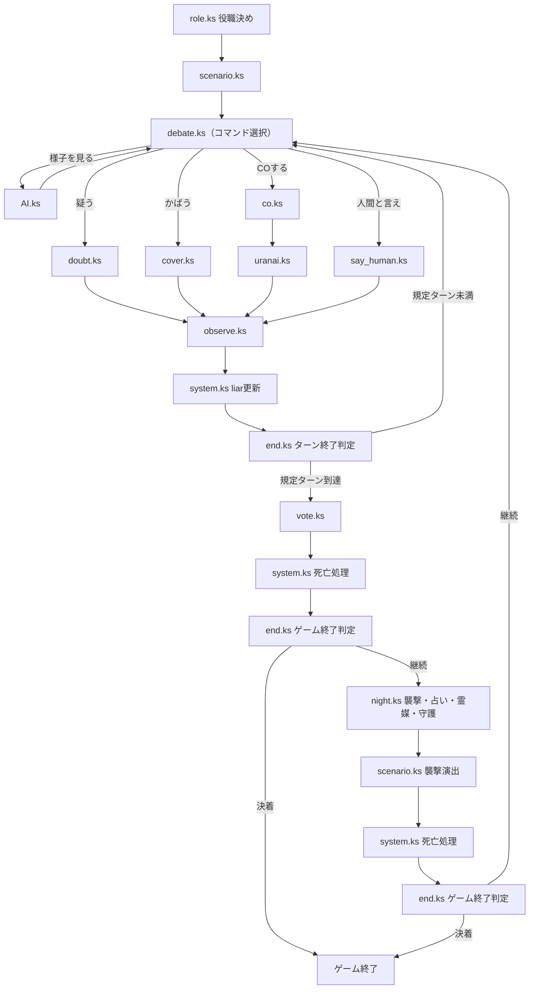

# ジャンケット人狼ゲーム ― 設計解説（ポートフォリオ）


**志望職種：ゲームプランナー / テクニカルプランナー / PM**

**[▶ 今すぐ遊ぶ（デモ）](https://bug-slayers-n.github.io/JB_JINRO/)**
**[▶ プレイ動画を見る（X/Twitter）](https://x.com/fanmadegame_JB/status/2058382599433887843)**
**[一般公開リポジトリ → JB_JINRO](https://github.com/bug-slayers-N/JB_JINRO)**

---

## 📌 要約

- 漫画『ジャンケットバンク』二次創作のAI対戦型人狼ゲーム（非公式・ファンメイド）
- 企画・要件定義・仕様策定・進行管理を1人で担当。コードの記述はClaudeが翻訳、バグ特定・修正は自分でコードを読んで対応
- イラスト担当・テスターを含む**3者体制**で、本業（週5勤務）と並行し**約2ヶ月でリリース**
- 公開1ヶ月で**1,300アクセス・告知ツイート44,000インプレッション・配信2件**
- 5人モード公開済み。9人モード開発中（2026年9月公開予定）

### 🔍 このプロジェクトで示せること

- **要件定義力**：「人間の曖昧な読み合い」をHP・好感度・視点付き認識という数値構造に翻訳した設計力
- **テクニカルプランナーとしての設計力**：確率式・AIロジック・拡張性設計をすべて自分で仕様化し、ロジックの意思決定はすべて自分が担当
- **複数リソースを動かす進行管理力**：イラスト・実装・テストという異なる役割の3者を動かし1つの成果物として完成
- **技術理解を伴うディレクション**：実装の構造まで把握した上で指示を出せる、技術知見のある進行管理

---

## 目次

- [🤝 体制・進行管理](#-体制進行管理)
- [🎮 ゲーム概要](#-ゲーム概要)
- [🧠 設計思想①：人狼を「HP」で再現する](#-設計思想人狼をhpで再現する)
- [🏗️ 設計思想②：拡張性を見据えた構造](#️-設計思想拡張性を見据えた構造)
- [🛠️ 技術スタック・ファイル構成](#️-技術スタックファイル構成)
- [📋 ゲームフロー図](#-ゲームフロー図)
- [📝 今後の実装予定](#-今後の実装予定)
- [ライセンス・クレジット](#ライセンスクレジット)

---

## 🤝 体制・進行管理

| 役割 | 担当 |
|---|---|
| 企画・要件定義・進行管理・バグ対応 | らき（個人サークル「第n次バグ討伐隊」） |
| イラスト・UI | [サカゴメさん](https://x.com/sakgm831) |
| テスト | 別途テスターを起用（クレジットはゲーム本体に記載） |

**スケジュール**：2026年3月28日 開発開始 → 5月24日 公開（約2ヶ月弱）。本業（週5勤務）と並行し、公開までにゲームバランス調整・バグ対応を含むテスト期間も確保。

**フィードバックループ**：イラスト担当には現場からの提案を受け付ける運用にしており、実際にイラスト側の提案から特定条件で専用グラフィックが表示される特殊エンディング演出を仕様に追加・実装しています。

**テストとリスクマネジメント**：ゲーム制作の経験からトラブルが起きやすい箇所を事前に想定して設計段階で対策。テストで見つかったバグ約20件を修正し、公開後の不具合報告は再現性の低い1件のみで済みました。

**設計の反省点**：当初は拡張性を考えずに実装を始め、途中で仕様を再設計しました。最初から拡張性を前提に固めてから実装に入るべきだったという教訓を、9人モード以降の開発に活かしています。

---

## 🎮 ゲーム概要

AI対戦型の人狼推理ゲームです。プレイヤー1人＋AI最大8人で、怪しい相手を疑い・かばい・嘘を見破ることを目指します。現在5人モード（人狼1・狂人1・占い師1・村人2）が公開済み。9人モード（霊媒師・騎士追加）を開発中、13人モード（妖狐追加）を構想中です。

---

## 🧠 設計思想①：人狼を「HP」で再現する

### なぜ「HP」か

既存タイトル（グノーシア等）のアプローチをそのまま採用すると独自性がなくなります。そこで「怪しい相手を疑い、嘘を見破る」という抽象的な読み合いを、**HP・ダメージ・回復という直感的な構造**に翻訳しました。

- HPが低いキャラほど嘘がバレやすい
- 「疑う」＝ ダメージ、「かばう」＝ 回復

### HP = calm（平常心） + like（好感度）

| 要素 | 役割 |
|---|---|
| **calm** | キャラごとに初期値が異なる基礎HP |
| **like** | キャラ間の好感度（視点付き）。疑うと下がり、かばうと上がる |

likeは視点付き（Aから見たB、Bから見たAを別の値として管理）なので、「Aは Bを信頼しているが、BはAを信頼していない」という非対称な人間関係が成立します。この合計値を**知覚平常心**と呼び、低い順に下位2人が観測フェーズの対象として選ばれます。

### 観測フェーズ：仕様書から実装への変換例

以下の日本語仕様書をClaudeに渡してコードへ変換させています。**ロジックの設計・意思決定はすべて自分が行い、Claudeはその翻訳のみを担当しています。**

```
f.aliveを確認し生存キャラに対して、知覚平常心（f.calm + f.like）を取得する
知覚平常心の下位2人に対して以下の処理を行う

視点キャラの観察力（ハードコード）- 知覚平常心 = 差分

差分 ≦ 0 → 観測失敗（処理終了）
差分 > 0 → f.characterを参照し対象が人狼陣営（< 10）か確認

人狼陣営でない → 観測失敗（処理終了）
人狼陣営 → （観察力 ÷ 5 + 差分 ÷ 2）÷ 100 の確率で抽選

外れ → 観測失敗。対象へのlike（好感度）を加算する
当選 → 視点キャラのf.liarの該当枠に1を代入
       f.player視点の当選時はtargetにliar、ai_resultに当選キャラ番号を格納
```

失敗時にlikeを加算するのは「やっぱり違うかも…」という心理の表現で、同じキャラへの観測が固定化されることを防ぐ仕組みでもあります。

### liar：キャラごとに異なる「知っていること」

liar変数は各キャラ視点での「誰が嘘をついているか」の認識を視点ごとに個別管理しています。全キャラが同じ情報を共有する「神視点」ではなく、**見えている情報がキャラごとに異なる**ことで、AI同士が個別に間違えたり疑心暗鬼になったりする人間らしい推理が生まれます。

---

## 🏗️ 設計思想②：拡張性を見据えた構造

### キャラごとの値はすべて配列で一元管理

役職は `f.character`、平常心は `f.calm` という1本の配列で管理。配列の長さを伸ばすだけで人数を増やせます。

```javascript
function getRole(i){ return parseInt(String(f.character).split(',')[i-1]); }
function getCalm(i){ return parseFloat(String(f.calm).split(',')[i-1]); }
```

### 役職番号は「桁」が陣営を兼ねる設計

| 役職 | 番号 | 陣営 |
|---|---|---|
| 人狼 | 1〜5 | 人狼陣営 |
| 狂人 | 9 | 人狼陣営 |
| 占い師 | 10 | 村人陣営 |
| 霊媒師 | 11 | 村人陣営 |
| 騎士 | 12 | 村人陣営 |
| 村人 | 15〜（連番） | 村人陣営 |

```javascript
function isWolfTeam(role){ return role < 10; }
```

一桁が人狼陣営、二桁が村人陣営という区切りにより、新しい役職を追加しても陣営判定ロジック自体は変更不要。liar・like配列のサイズも `n×(n-1)` という汎用式で導出できます（9人=72値、13人=156値）。

---

## 🛠️ 技術スタック・ファイル構成

| 分類 | 使用技術 |
|---|---|
| ゲームエンジン | [TyranoBuilder](https://tyranobuilder.com/)（ノベルゲームエンジン） |
| ロジック・AI実装 | JavaScript（iscriptコンポーネント） |
| 状態管理 | TyranoBuilder標準のセーブ機能（外部ファイル・外部DB不使用） |
| 公開 | GitHub Pages |

会話パートはTyranoBuilderに任せ、数値管理・AIロジックだけをiscriptで自作する役割分担です。

### ファイル構成

| ファイル | 役割 |
|---|---|
| `start.ks` / `tutorial.ks` | プロローグ・チュートリアル |
| `role.ks` / `scenario.ks` | 役職決め・ストーリー進行 |
| `system.ks` / `end.ks` | 初期化・死亡処理・ターン終了判定 |
| `debate.ks` / `AI.ks` / `UI.ks` | 議論フェーズ・AI行動・UI |
| `doubt.ks` / `cover.ks` / `observe.ks` | 疑う・かばう・観測処理 |
| `co.ks` / `uranai.ks` / `say_human.ks` | CO・占い・「人間と言え」処理 |
| `vote.ks` / `night.ks` | 投票・夜フェーズ（襲撃・占い・霊媒・守護） |
| `キャラ名.ks` | 各キャラクター個別の台詞 |

---

## 📋 ゲームフロー図


```mermaid
flowchart TD
    R[role.ks 役職決め] --> S[scenario.ks]
    S --> DB["debate.ks（コマンド選択）"]
    DB -->|疑う| Doubt[doubt.ks]
    DB -->|かばう| Cover[cover.ks]
    DB -->|様子を見る| AI[AI.ks] --> DB
    DB -->|COする| CO[co.ks] --> Uranai[uranai.ks]
    DB -->|人間と言え| Human[say_human.ks]

    Doubt --> OB[observe.ks]
    Cover --> OB
    Uranai --> OB
    Human --> OB

    OB --> SYS[system.ks liar更新]
    SYS --> END1[end.ks ターン終了判定]
    END1 -->|規定ターン未満| DB
    END1 -->|規定ターン到達| VOTE[vote.ks]

    VOTE --> SYS2[system.ks 死亡処理]
    SYS2 --> END2[end.ks ゲーム終了判定]
    END2 -->|決着| GameEnd[ゲーム終了]
    END2 -->|継続| NIGHT[night.ks 襲撃・占い・霊媒・守護]
    NIGHT --> SC2[scenario.ks 襲撃演出]
    SC2 --> SYS3[system.ks 死亡処理]
    SYS3 --> END3[end.ks ゲーム終了判定]
    END3 -->|決着| GameEnd
    END3 -->|継続| DB
```

---

## 📝 今後の実装予定

| モード | ステータス | 内容 |
|---|---|---|
| 9人モード | 開発中（2026年9月公開予定） | 霊媒師・騎士の追加、抽選・投票対象の9人拡大 |
| 13人モード | 構想段階 | 妖狐陣営の追加（襲撃では死亡せず、処刑または占いで死亡。終了時生存で単独勝利） |

---

## ライセンス・クレジット

本プロジェクトは漫画『ジャンケットバンク』の**非公式ファンメイド・二次創作**です。原作の著作権は原作者・出版社に帰属します。権利者様からの削除要請があった場合、速やかに非公開とします。

イラスト・背景素材の著作権は、それぞれの制作者に帰属します。無断転用・再配布はできません。本プロジェクトの**設計・コード部分は自由に利用可能**です。

| 担当 | 内容 |
|---|---|
| 企画・設計・ゲームロジック | らき（個人サークル「第n次バグ討伐隊」） |
| 立ち絵・UIイラスト | [サカゴメ さん](https://x.com/sakgm831) |
| 背景素材 | アキ2号機 さん（フリー素材） |
| 実装 | [Claude](https://claude.ai)（日本語の詳細仕様書をもとにコードへ翻訳） |

